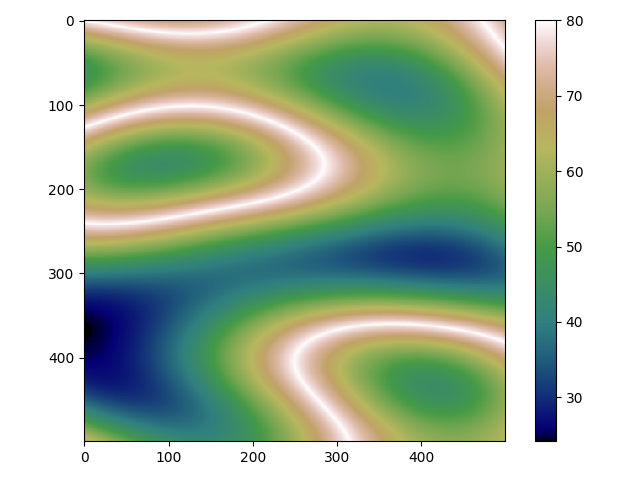
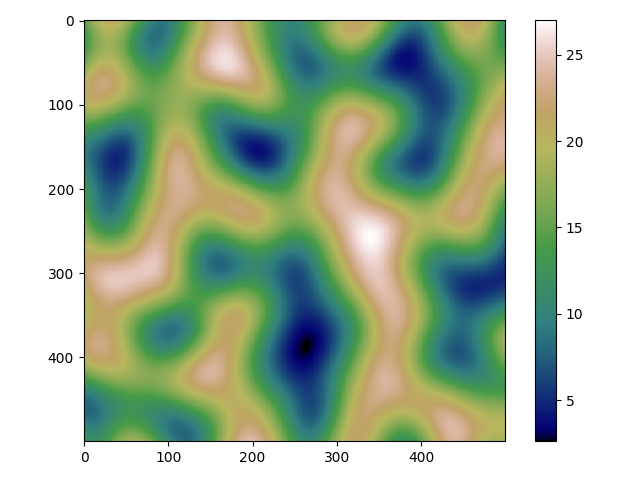
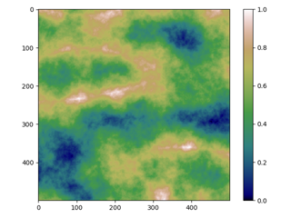
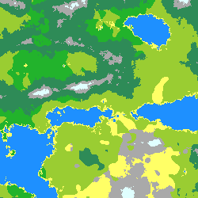
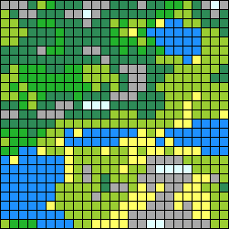
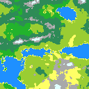
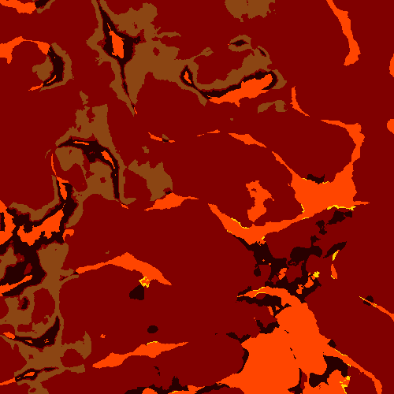

# Tile Maps

## Table of contents
1. [ How does it work ](#howdoesitwork)
2. [ Dependencies ](#deps)
3. [ Usage ](#usage)
4. [ Parameters ](#params)
    - [ seed ](#seed)
    - [ config path ](#cfgpth)
    - [ resolution ](#res)
    - [ grid ](#grid)
    - [ output path ](#outpth)
    - [ octave multiplier](#octmultiplier)
5. [ World generator config ](#worldcfg)
    - [ Parameters ](#worldcfg-params)
    - [ Example](#worldcfg-example)
6. [ Examples ](#examples)


## How does it work <a name="howdoesitwork"></a>
Tile Maps is a program for generating tile maps written in python.
It uses simplex noise to generate noise maps. 
In order to create complex, realistic height maps, 
the program combines various many simplex noise maps with different settings as octave, noise or exponent.
The same principle rules creating moisture maps.
After combining both moisture and height maps, the program creates biome map, assigns them the appropriate colors 
defined in the configuration and generates output picture.

The world configuration is stored as a dict.
The SimplexNoise class is used to create noise maps. 
It uses the OpenSimplex library. Two-dimensional
noise function has the form: 

_**value=noise_function(x,y)**_

OpenSimplex library provides such a function.
The simplex_noise module uses it to generate noise maps (stored as numpy 2d arrays of floats).

The terrain module takes care of generating world's terrain as specified in the configuration.
 

### Example
Examples of a ridge (left) and simplex (right) variants of the noise maps:




After combining them and many other layers of noise maps, we get something like this:



On the same principles, terrain class generates moisture map:


After assigning proper height and moisture values their biome, 
the program assigns biome to the specific color of that biome as specified in configuration, and generates an output image:



## Dependencies <a name="deps"></a>


Use the package manager [pip](https://pip.pypa.io/en/stable/) to install dependencies.

```bash
pip install -r requirements.txt
```

## Usage <a name="usage"></a>

```bash
python3 gen_tile_map.py <arguments>
```

## Parameters <a name="params"></a>

All available input parameters are described below.
No arguments are required.

### seed <a name="seed"></a>
World seed of positive integer type.

Default: 0

Example:

```bash
python gen_tile_map.py --seed 123
```

### config path <a name="cfgpth"></a>
World generator configuration path (string, file must be of json type).

Default: 'default_world_config.json'

Example:

```bash
python gen_tile_map.py --config_path 'my_world_config.json'
```

### resolution <a name="res"></a>
Define the shape of the tile map (tuple of positive integers).

Default value should be in world_config json (world generator is dependent on shape),
if it is not found there, the default value is (256,256)

Example:

```bash
python gen_tile_map.py --resolution 512 512
```

### grid <a name="grid"></a>
Tell the program whether you want to add grid to the output image.

**WARNING!** the grid increases the output image resolution 10 times in each dimension.

Default: False

Example:

```bash
python gen_tile_map.py --grid
python gen_tile_map.py --no_grid
```

Output 25x25 map with grid parameter:



### output path <a name="outpth"></a>
Tile map image output path (string, file must be of png type).

Default: 'output.png'

Example:

```bash
python gen_tile_map.py --output_path 'my_output.png'
```

### octave multiplier <a name="oct-multiplier"></a>
A optional parameter used for scaling octaves in both dimensions (tuple of non-negative floats).

The tuple values ​​indicate the octave multiplier for the x, y axises, respectively.
 
All the octave values from the world config are multiplied by the corresponding dimension's multiplier.

Useful, when the map resolution ratio is different than 1:1, and you want to preserve the octave frequency 
settings. For Example When you set the resolution to 128x256 you probably want these multipliers to be (1, 2). 
That setting is going to stretch the map in y dimension so that the octave frequency is the same as in default 
1:1 ratio resolution.

By default, the program uses octave values from the world config. 

Example:

```bash
python gen_tile_map.py --octave_multiplier 1 2.5
```

Before and after applying the example parameter:


## World generator config <a name="worldcfg"></a>
The world generator config is stored in the dict loaded from a json file passed as an argument to the program. 
(see <a name="cfgpth">config path program parameter</a>)

All available world config parameters are described below.
If the parameter does not have a default value specified, it means that the parameter is required.

### shape <a name="worldcfg-params"></a>

Define the shape of the tile map (tuple of positive integers).

Default: (256, 256)

### normalization range
Define the range to which output map values are scaled (tuple of floats).

Its useful when you want to create more complex biome thresholds.
If you set normalization range to bigger values, you could avoid using floats.

Default: (0, 1)

### height map/moisture map
These parameters store data as an array of dictionaries of described below parameters.
Dicts are stored in the array, to combine the maps with different parameters as *noise variant* or *noise exp*

For example in the default world config, there is a *ridge noise variant* on top 
(the biggest distribution values of all layers) of other *simplex noise variant* layers.
It is configured in such a way, as to create realistic looking mountain ranges.

Height and moisture maps parameters are the same.

#### noise_variant
Available options:
- "ridge"
- "simplex"

Default: "simplex"

#### octaves
This parameter is used to set the number of noise octaves on a given dimension for all the noise layers of the map.
It is stored as an array of two-valued tuples (x, y axis settings respectively).

The array's length is a number of noise map layers and it must be the same as length of the 
*elevation_distribution* array.

Example:

For comparision there are 2 images of *one-layer simplex noise variant* noise maps 
with 5 octaves (left) and 2.5 octaves (right) settings in both dimensions.


If you look closely, you can notice that the right picture is in fact differently normalized and scaled 
upper left section of the left one.

*These examples are made with the height_map_simplex.json and height_map_simplex_half_octaves.json configs located
in the examples/example_world_configs folder. 
Biome mapping in that config lacks moisture data. Only height map is visible on the pictures.*

#### elevation_distribution
This parameter is used to set the relative multipliers for all the noise layers of the map.
It is stored as an array of floats of the same length as the length of *octaves* parameter's array. 
Its destination layer correspond the octave setting with the same array's element index number.

#### noise_exp
This parameter (single, non-negative float type number) is used to set the exponent of all the noise map values after 
combining the generated noise map layers.
All the output map's values are modified using the formula below:

*output_map\[x]\[y] = output_map\[x]\[y]^noise_exp*

Examples:

The animations below show how changing a parameter affects the distribution of biomes.
On the left animation the height map exponent changes and on the right the moisture map exponent changes.


### biomes
A dict that stores all the biome names (strings) as a key and corresponding RGB color as a value 
(three-valued tuples of positive 8-bit integers (0-255)).

### biome_thresholds
An array that stores the information which biome is assigned to a given combination of height and moisture.
It is an array of two-valued tuples.
Let's assume that arr is the biome_thresholds array, and the normalization is a tuple of normalization boundaries 
(as specified in the config file).

*arr\[x]\[0]* value is the threshold below which all the height  is assigned to 

For any positive x in range of len(arr):

*arr\[x-1]\[0] < arr\[x]\[0]*

*arr\[x]\[1]* is an array of tuples of moisture thresholds, and biomes assigned to them.

The tuples stored in the array are (float > 0 (threshold), string (biome name))

For any positive y in range of len(arr\[x]\[1]):

*arr\[x]\[y-1]\[1] < arr\[x]\[y]\[1]*

### Example config <a name="worldcfg-example"></a>
simple config with 3 biomes
```json
{
  "shape": [250, 250],
  "normalization_range": [0.0, 1.0],
  "height_map": [
    {
      "noise_variant": "simplex",
      "octaves": [
        [5, 5],
        [10, 10]
      ],
      "elevation_distribution": [2, 1],
      "noise_exp": 1
    },
    {
      "noise_variant": "ridge",
      "octaves": [
        [2, 2]
      ],
      "elevation_distribution": [3]
    }
  ],
  "moisture_map": [
    {
      "octaves": [
        [30, 30]
      ],
      "elevation_distribution": [1]
    }
  ],
  "biomes":
  {
    "WATER": [30, 144, 255],
    "DESERT": [255, 255, 102],
    "GRASSLAND": [154, 205, 50]
  },
  "biome_thresholds":
  [
    [0.3, [[1.0, "WATER"]]],
    [0.4, [[1.0, "DESERT"]]],
    [0.59, [[0.4, "DESERT"], [1.0, "GRASSLAND"]]],
    [0.80, [[0.7, "DESERT"], [1.0, "GRASSLAND"]]],
    [1.0, [[1, "DESERT"]]]
  ]
}
```
Output image created with this config:


## Examples <a name="examples"></a>
### Default world config
Example of a world generated with the default config.


### Lava world config
Example of a world generated with the lava_world_config.json.

